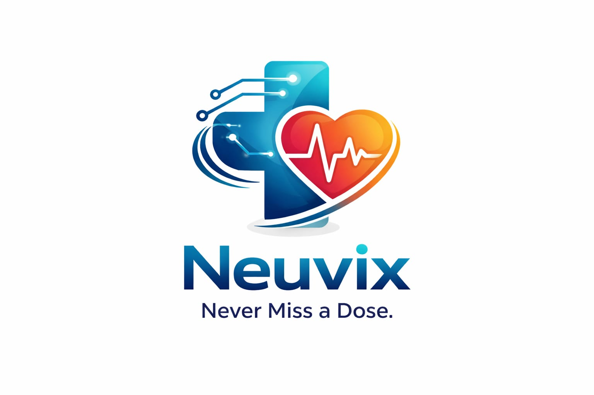

<div align="center">
  
  <h1>🤖 Baymax Companion</h1>
  <h3><em>Your Personal, AI-Powered Healthcare Assistant</em></h3>

  [](https://expo.dev/)
  [](https://reactnative.dev/)
  [](https://groq.com/)
  [](https://opensource.org/licenses/MIT)
</div>

---

## 🌟 Overview
**Baymax Companion** is an intelligent, offline-capable mobile healthcare assistant built using React Native and Expo. It uniquely combines advanced **Natural Language Processing (NLP)**, **Voice-to-Voice Interaction**, and native OS alerting to improve medication adherence and emotional well-being for patients. 

Inspired by the helpful nature of Baymax, the app provides a highly accessible voice-first experience for managing medications, tracking vitals, monitoring daily hydration, and ensuring personal safety through automated emergency protocols.

> *"Hello. I am Baymax, your personal healthcare companion."*

---

## ✨ Comprehensive Features

### 🎙️ Conversational AI & Voice Control
* **Voice-First Interface**: Schedule medications just by talking naturally: *"Baymax, remind me to take Aspirin at 8 PM."*
* **Groq-Powered Intelligence**: Uses Whisper (Speech-to-Text) and LLaMA-3.3 (via Groq Cloud) for lightning-fast voice transcription and empathetic responses.
* **Instant Logging**: Simply say *"I took my medicine"* to securely log your adherence via voice.

### 💊 Advanced Medication Tracking
* **Chronological Parsing**: Automatically extracts drug names and precise times from your voice prompt using Chrono-Node algorithms.
* **Offline Push Alerts**: Schedules native OS alarm banners that trigger reliably even if the device completely loses internet access.
* **Actionable Tracking**: Tap **"Take"** to physically log a dose or **"Snooze"** to intelligently delay the alarm by exactly 10 minutes.

### 🩺 Vitals & Mood Tracking
* **Voice Health Scans**: Initiates simulated visual health checks and asks for your current physical pain scale (1-10) directly via the conversational interface.
* **Emotional Wellness**: Passively tracks emotional patterns via voice sentiment analysis to generate an accurate "Mood Trend" metric.

### 💧 Hydration Analytics & 📈 Dashboards
* Track your daily water intake with a single tap to fill up a visual progress ring.
* View your **Health Score**, an aggregated metric of your physical pill adherence, missed doses, and recorded pain scales, dynamically rendered on your daily Dashboard.

### 🚨 Native Emergency Protocol
* **Secure Guardian Config**: Save a custom Emergency Guardian phone number directly to the device's secure local memory (No cloud accounts required).
* **Instant Handoff**: In a crisis, tapping the Red Emergency card instantly bypasses the app and hands the Guardian's number back to the phone's native dialer to place a live SOS call.

---

## 🏗️ System Architecture 

The application follows an **Offline-First Client Architecture**. 
All data (Medications, Adherence Logs, Pain Levels, Custom Settings) is persisted exclusively onto the user's localized device storage via React Native `AsyncStorage`. The only external dependencies are stateless REST API calls to Groq Cloud for speech and text processing.

```mermaid
flowchart TB
    %% Defines Architectural Layers & Styles
    classDef ui fill:#E3F2FD,stroke:#1565C0,stroke-width:2px,color:#0D47A1
    classDef core fill:#F3E5F5,stroke:#7B1FA2,stroke-width:2px,color:#4A148C
    classDef hardware fill:#E8F5E9,stroke:#2E7D32,stroke-width:2px,color:#1B5E20
    classDef external fill:#FFF3E0,stroke:#E65100,stroke-width:2px,color:#E65100
    classDef data fill:#FFEBEE,stroke:#C62828,stroke-width:2px,color:#B71C1C

    %% --------------------------------------------------
    %% 1. APPLICATION MODULES (Client App)
    %% --------------------------------------------------
    subgraph AppModules [Layer 1: Application Modules]
        direction TB
        UI_Home[Home & Dashboard UI]:::ui
        UI_Voice[Voice Assistant UI]:::ui
        UI_Med[Medication & Vitals UI]:::ui
        
        Logic_Time[Time & Region Service]:::core
        Logic_NLP[Local NLP Parser]:::core
        Logic_Analytics[Health Analytics Engine]:::core
        
        UI_Home <--> Logic_Analytics
        UI_Voice <--> Logic_NLP
        UI_Med <--> Logic_Time
        UI_Med <--> Logic_Analytics
    end

    %% --------------------------------------------------
    %% 2. LOCAL DATA PERSISTENCE
    %% --------------------------------------------------
    subgraph LocalStorage [Layer 2: On-Device Storage]
        DB[(AsyncStorage System)]:::data
        DB_Schema["Schema:\n- Medications\n- Vitals Logs\n- Adherence History"]:::data
        DB --- DB_Schema
    end

    %% --------------------------------------------------
    %% 3. HARDWARE COMPONENTS (OS Level)
    %% --------------------------------------------------
    subgraph Hardware [Layer 3: Hardware & OS]
        HW_Mic[Physical Microphone]:::hardware
        HW_Speaker[Physical Speaker]:::hardware
        HW_Push[OS Notification System]:::hardware
        HW_Dialer[OS Phone Dialer]:::hardware
    end

    %% --------------------------------------------------
    %% 4. EXTERNAL SERVICES
    %% --------------------------------------------------
    subgraph External [Layer 4: External Cloud Services]
        API_Whisper((Groq Whisper API\nSpeech-to-Text)):::external
        API_LLM((Groq LLaMA-3.3 API\nIntent Engine)):::external
    end

    %% SYSTEM COMMUNICATION PATHS
    AppModules <-->|JSON Read/Write| LocalStorage

    UI_Voice -->|Starts Recording| HW_Mic
    Logic_NLP -->|Triggers TTS| HW_Speaker
    Logic_Time -->|Schedules Alert| HW_Push
    UI_Home -->|Executes 'tel:' link| HW_Dialer
    
    HW_Mic -->|Returns Audio| UI_Voice
    HW_Push -->|User taps banner| UI_Med

    UI_Voice -->|HTTPS POST: Audio File| API_Whisper
    API_Whisper -->|HTTPS Res: Transcript Text| UI_Voice
    
    Logic_NLP -->|HTTPS POST: Text + Prompt| API_LLM
    API_LLM -->|HTTPS Res: Extracted Details| Logic_NLP
```



---

## 📂 Repository Structure

```text
KGISL_Baymax/
├── baymax_companion/     # The Main React Native (Expo) Mobile Application
│   ├── src/              # Source Code (Components, Screens, Services)
│   ├── images/           # Application Assets & Branding
│   ├── App.js            # Root Navigation & Notifications
│   └── app.json          # Expo Configuration
└── landingpage_cp1/      # Web-based Landing Page (Checkpoint 1)
```

---

## 🛠️ Project Setup & Installation

### Prerequisites
Make sure you have [Node.js](https://nodejs.org/), [npm](https://www.npmjs.com/), and the [Expo CLI](https://expo.dev/) installed. It is strongly recommended to test using the **Expo Go** application on your physical iOS or Android device.

### 1. Clone the repository
```bash
git clone https://github.com/Vinitharameshchand/KGISL_Baymax.git
cd KGISL_Baymax
```

### 2. Enter the app directory
```bash
cd baymax_companion
```

### 3. Install dependencies
```bash
npm install
```

### 4. Provide Environment & API Definitions
Ensure you have replaced the default API constants in `src/services/aiService.js` and `src/services/audioService.js` with your active Groq API Key if necessary for deployment.

### 5. Run the Application
Start the Expo development server:
```bash
npx expo start
```
- Open the **Expo Go** app on your physical device.
- Scan the QR code rendered in your terminal.
- *Note: Emulators can be utilized by pressing `i` (for iOS Simulator) or `a` (for Android Emulator) within the active terminal, though a physical device is strictly required for native Microphone support!*

---

<p align="center">
  <i>“I cannot deactivate until you say you are satisfied with your care.”</i>
</p>
