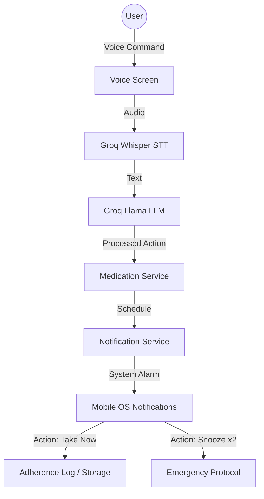

# 🤖 Baymax Companion
### *Your Personal Healthcare Companion*

[](https://expo.dev/)
[](https://reactnative.dev/)
[](https://groq.com/)
[](https://opensource.org/licenses/MIT)

---

## 🌟 Overview
**Baymax Companion** is a compassionate, AI-powered mobile application designed to improve medication adherence and emotional well-being for elderly patients and individuals with chronic illnesses. Inspired by the helpful nature of Baymax, the app combines **Natural Language Processing (NLP)**, **Voice-to-Voice Interaction**, and **Smart Notification Systems** to ensure you never miss a dose.

> "Hello. I am Baymax, your personal healthcare companion."

---

## ✨ Key Features

### 🎙️ Conversational AI & Voice Control
*   **Voice-First Interface**: Schedule medications just by talking: *"Baymax, remind me to take Aspirin every morning at 8 AM."*
*   **Groq-Powered Intelligence**: Uses Llama 3.1 & Whisper (via Groq) for lightning-fast voice transcription and empathetic responses.
*   **Natural Language Time Parsing**: Understands context like "tonight," "after lunch," or "tomorrow morning."

### 💊 Advanced Medication Tracking
*   **Smart Reminders**: Automated system notifications with real-time IST time synchronization.
*   **Interactive Actions**: Manage your health directly from the lock screen with **"Take Now"** or **"Snooze"** buttons.
*   **Adherence Logging**: Automatically logs your doses when confirmed, building a streak and tracking your health journey.

### 🚨 Safety & Emergency Protocol
*   **Emergency Phrase Detection**: Detects critical phrases like *"Chest pain"* or *"I can't breathe"* and triggers immediate alerts.
*   **Snooze Safety Mechanism**: If a user snoozes a reminder 2 times consecutively, the app automatically triggers an **Emergency Alert** to notify close ones.

### 🧘 Wellness & Support
*   **Breathing Exercises**: Integrated guided breathing sessions for stress relief.
*   **Health Dashboard**: Visual representation of medication streaks and history.
*   **Emotional Companion**: Designed to reduce loneliness through friendly, empathetic conversation.

---

## 🛠️ Technical Stack

-   **Framework**: [React Native](https://reactnative.dev/) with [Expo SDK 54](https://expo.dev/)
-   **AI Engine**: [Groq Cloud](https://groq.com/) (Llama-3.3-70b & Whisper-large-v3)
-   **State Management**: Local Persistence via `AsyncStorage`
-   **Notifications**: `expo-notifications` with custom Action Categories
-   **Speech Services**: `expo-speech` (TTS) and `expo-audio` (Recording)
-   **Time Service**: Real-time IST sync via [API Ninjas World Time](https://api-ninjas.com/api/worldtime)

---

## 🏗️ System Architecture



---

## 🚀 Installation & Setup

### Prerequisites
-   Node.js (LTS)
-   Expo Go app on your mobile device (iOS/Android)
-   A Groq API Key

### Configuration
1.  **Clone the Repository**:
    ```bash
    git clone https://github.com/Vinitharameshchand/KGISL_Baymax.git
    cd KGISL_Baymax/baymax_companion
    ```

2.  **Install Dependencies**:
    ```bash
    npm install
    ```

3.  **Setup API Keys**:
    Open `src/services/aiService.js` and add your Groq API key:
    ```javascript
    const GROQ_API_KEY = "your_key_here";
    ```
    Open `src/services/timeService.js` and add your API Ninjas key for accurate IST:
    ```javascript
    const API_NINJAS_KEY = "your_key_here";
    ```

4.  **Launch**:
    ```bash
    npx expo start
    ```
    Scan the QR code with your **Expo Go** app.

---

## 📂 Project Structure
```text
baymax_companion/
├── src/
│   ├── components/       # Reusable UI Patterns
│   ├── constants/        # Design tokens & Colors
│   ├── screens/          # App Pages (Dashboard, Voice, etc.)
│   ├── services/         # Logic (AI, Notif, Meds, Time)
│   └── utils/            # Helper functions
├── App.js                # Root Navigation & Global Listeners
└── app.json              # Expo Configuration
```

---

## 🛡️ Future Roadmap
-   [ ] **Real-time SMS Integration**: Connect to Twilio for actual emergency SMS alerts.
-   [ ] **Prescription Scanning**: Use OCR to automatically extract medication data from photos.
-   [ ] **Family Dashboard**: A web portal for relatives to monitor adherence remotely.
-   [ ] **Vitals Integration**: Connect with Apple Health or Google Fit for heart rate monitoring.

---

## 📄 License
This project is licensed under the MIT License - see the [LICENSE](LICENSE) file for details.

---
*Created with ❤️ by the Baymax Development Team*
